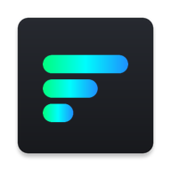
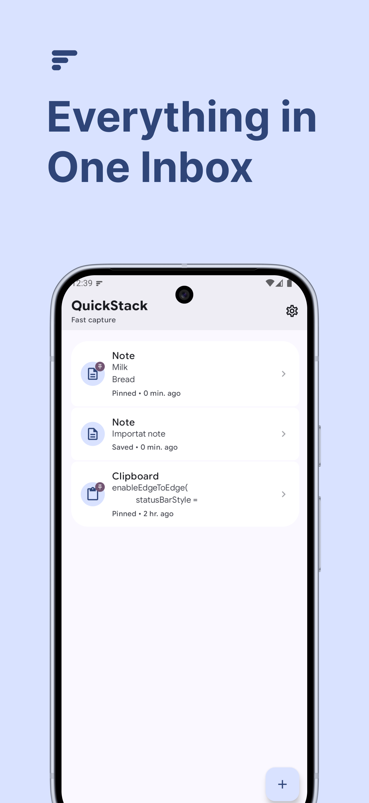
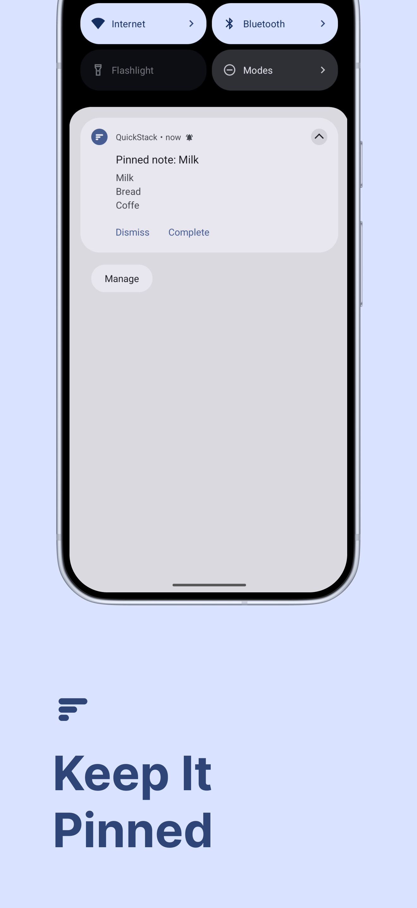
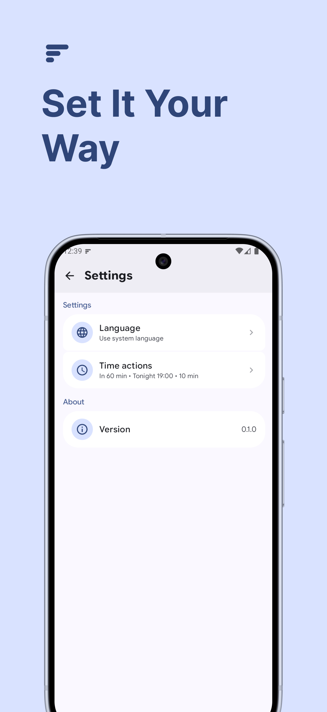
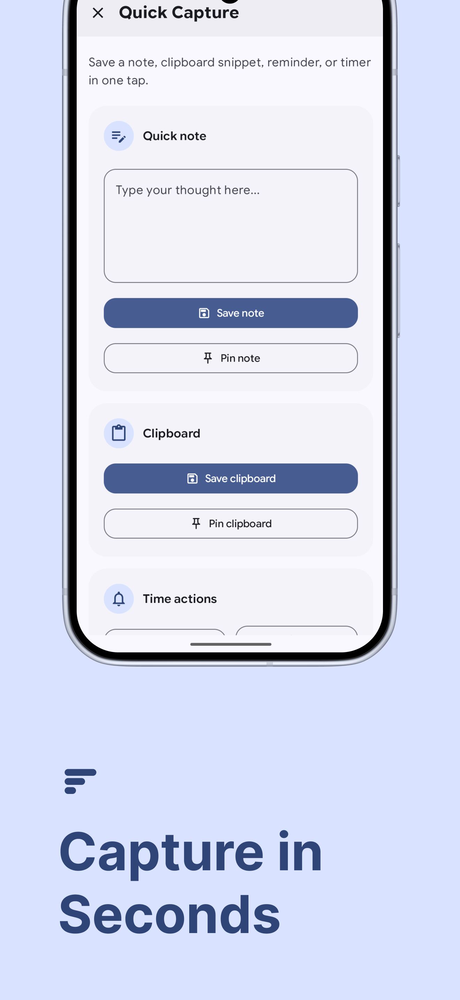
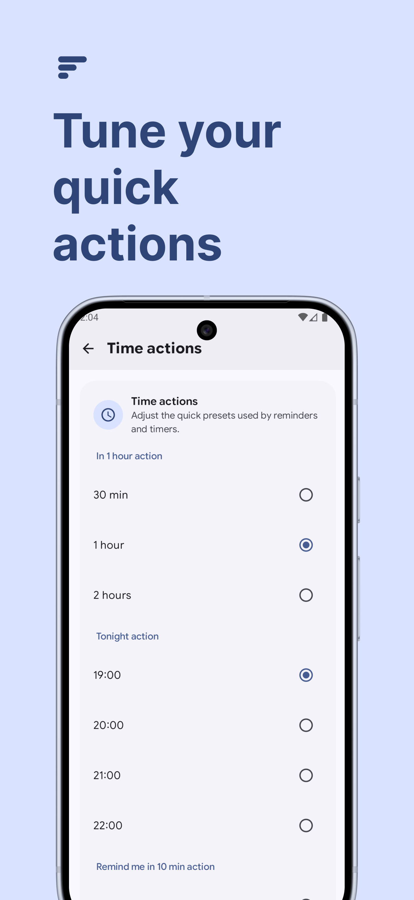
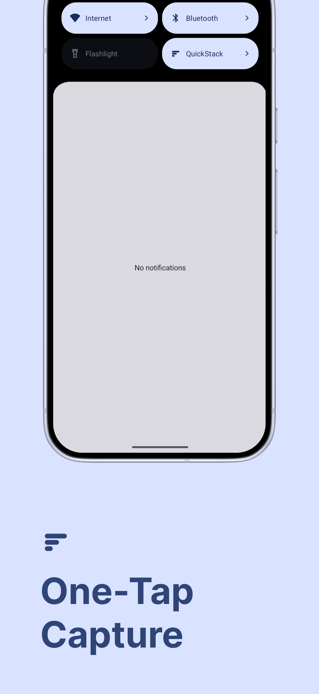

<div id="user-content-toc">
  <ul style="list-style: none;">
    <summary>
      <h1>QuickStack</h1>
      <p>
      <a href="https://opensource.org/licenses/Apache-2.0"></a>
      <a href="https://kotlinlang.org"></a>
    </summary>
  </ul>
</div>

QuickStack is an Android fast-capture app built around the Quick Settings Tile.

The goal is simple: pull down Quick Settings, tap the tile, capture something useful in a few seconds, then get out.

## Screenshots

<p align="center" width="100%">
  





</p>

QuickStack currently supports:

- quick text notes
- clipboard capture
- pinned note or clipboard notifications
- quick reminder presets
- a quick 10-minute reminder flow
- a local inbox/history
- lightweight settings for language and time-action presets

## Why QuickStack

- `Quick Settings Tile` first: capture starts from the fastest Android surface available
- minimal actions: note, clipboard, reminder, and timer presets without form-heavy flows
- local-first: everything stays on device with native Android persistence and notifications

## Status

This repository contains a working MVP foundation.

Implemented today:

- Quick Settings Tile entry point
- full-screen quick capture flow
- quick note save
- pinned note notifications
- clipboard save
- pinned clipboard notifications
- reminder preset: in 1 hour
- reminder preset: tonight
- quick 10-minute reminder preset
- Room-backed inbox/history
- delete, dismiss, and complete flows
- triggered reminder/timer notifications
- settings screen for language and time-action presets

Not implemented:

- custom reminder text
- snooze
- edit or reschedule flows
- reboot rescheduling
- exact alarm permission flow
- sync, backend, accounts, analytics, widgets

## Product Principles

QuickStack is intentionally narrow.

- fast capture over feature breadth
- minimal taps over rich editing
- native Android behavior over custom complexity
- local-first data over cloud features

## Screens

### Quick Tile

The tile is the primary entry point. One tap opens Quick Capture directly from Quick Settings.

### Quick Capture

Full-screen fast capture for notes, clipboard actions, reminders, and timer presets.

### Home

Local inbox/history for saved, pinned, scheduled, and completed items.

### Settings

Language selection, time-action presets, and app version in a lightweight settings area.

### Notifications

Pinned items stay visible, while reminder and timer triggers arrive as actionable notifications.

## Tech Stack

- Kotlin
- Jetpack Compose
- Material 3
- Hilt
- Room
- AlarmManager
- Android notification APIs
- TileService

Package name:

- `com.davideagostini.quickstack`

## Project Structure

```text
.
|-- app/
|   |-- build.gradle.kts                  # Android application module
|   |-- src/main/
|   |   |-- AndroidManifest.xml           # Activities, receivers, tile service, permissions
|   |   |-- java/com/davideagostini/quickstack/
|   |   |   |-- QuickStackApp.kt          # Application class
|   |   |   |-- MainActivity.kt           # Main launcher activity
|   |   |   |-- core/
|   |   |   |   |-- Localization.kt       # App locale helpers
|   |   |   |   |-- NotificationPermission.kt
|   |   |   |   |-- ui/                   # Theme, colors, typography, shared UI primitives
|   |   |   |   `-- viewmodel/            # Base ViewModel abstractions
|   |   |   |-- data/
|   |   |   |   |-- local/
|   |   |   |   |   |-- QuickStackDatabase.kt
|   |   |   |   |   |-- dao/              # Room DAO interfaces
|   |   |   |   |   `-- entity/           # Room entities and type converters
|   |   |   |   `-- repository/           # Storage, clipboard, and settings repositories
|   |   |   |-- di/
|   |   |   |   `-- AppModule.kt          # Hilt dependency graph
|   |   |   |-- domain/
|   |   |   |   `-- model/                # Unified quick-item model, item types, drafts, sources
|   |   |   |-- navigation/
|   |   |   |   |-- QuickStackNavigation.kt
|   |   |   |   `-- Screen.kt
|   |   |   |-- feature/
|   |   |   |   |-- capture/              # Quick capture flow from launcher/tile
|   |   |   |   |   |-- components/       # Capture-specific composables
|   |   |   |   |   `-- model/            # Capture UI state and events
|   |   |   |   |-- home/                 # Inbox/history screen
|   |   |   |   |   |-- components/       # Item rows and list UI
|   |   |   |   |   `-- model/            # Home state and events
|   |   |   |   |-- notifications/        # Notification actions and rendering
|   |   |   |   |-- reminders/            # Alarm scheduling, receiver, time calculation
|   |   |   |   `-- settings/             # Language and preset settings UI/state
|   |   |   |       |-- components/
|   |   |   |       `-- model/
|   |   |   `-- tile/
|   |   |       `-- QuickStackTileService.kt
|   |   `-- res/
|   |       |-- drawable/                 # App and tile assets
|   |       |-- font/                     # Shared app font
|   |       |-- mipmap-*/                 # Launcher icons
|   |       `-- values*/                  # Theme, colors, strings, localized resources
|   `-- src/test/java/com/davideagostini/quickstack/
|       |-- domain/model/                 # Draft and item-state tests
|       `-- feature/reminders/            # Reminder scheduling tests
|-- gradle/libs.versions.toml             # Centralized dependency versions
|-- build.gradle.kts                      # Root build configuration
|-- settings.gradle.kts                   # Module includes and plugin management
|-- CONTRIBUTING.md
`-- README.md
```

Main package responsibilities:

- `core`: shared Android/app utilities, theme system, and reusable UI/viewmodel base pieces
- `data`: Room persistence, entity mapping, clipboard access, and settings persistence
- `domain`: app-level models used across features without UI or storage details
- `navigation`: top-level Compose navigation graph and route definitions
- `feature/capture`: full-screen quick capture surface, quick actions, and note/clipboard/reminder entry flows
- `feature/home`: inbox/history presentation, deletion, completion, and item actions
- `feature/notifications`: persistent and actionable notifications plus broadcast action handling
- `feature/reminders`: reminder/timer scheduling logic built on `AlarmManager`
- `feature/settings`: lightweight preferences UI for localization and capture presets
- `tile`: Android Quick Settings Tile integration and tile tap entry point

## Architecture

QuickStack uses a small MVVM structure.

- `domain` defines the unified quick item model
- `data` owns Room, DAOs, entity mapping, and repositories
- `feature/*` owns screen-specific state and UI
- `notifications` handles pinned and triggered notifications
- `reminders` handles AlarmManager scheduling and alarm receivers
- `tile` exposes the Quick Settings Tile entry point

Runtime flow:

1. The user opens QuickStack from the launcher or the Quick Settings Tile.
2. `QuickCaptureActivity` shows the capture flow.
3. `CaptureViewModel` validates input and creates items through `QuickItemRepository`.
4. Pinned items are shown through `QuickStackNotificationManager`.
5. Reminder and timer presets are scheduled through `ReminderScheduler`.
6. `HomeViewModel` observes local storage and updates the inbox/history.

## Setup

Requirements:

- Android Studio recent stable
- Android SDK installed locally
- JDK 23 available to Gradle

If needed, create `local.properties` locally:

```properties
sdk.dir=/Users/<your-user>/Library/Android/sdk
```

`local.properties` should not be committed.

## Run

Build debug:

```bash
./gradlew assembleDebug
```

Run unit tests:

```bash
./gradlew testDebugUnitTest
```

Build release:

```bash
./gradlew assembleRelease
```

## Known Limitations

- reminders and timers are not rescheduled after device reboot
- reminder and timer presets are fixed, not free-form
- some new settings strings may still fall back to English in non-default locales
- reminder/timer dismiss vs complete are not stored as distinct final states
- delivery can be slightly delayed under doze or battery restrictions

## Roadmap

Short, practical next steps:

1. Reboot rescheduling for pending reminders and timers
2. Better reminder/timer state semantics and optional snooze
3. More polish on quick capture and settings UI
4. Complete localization coverage for settings
5. Expand a few repository and state tests

## Contributing

See [CONTRIBUTING.md](/Users/davideagostini/Documents/quick-stack/CONTRIBUTING.md) for contribution guidelines, branch naming, and PR title conventions.

## License

This repository is published under `Apache-2.0`.

## Good First Issues

- localize the new user-facing message strings in all supported languages
- add more tests for Room-backed item state transitions
- add reboot rescheduling for pending reminder/timer items
- refine `Language` and `Time actions` screens to match the home grouped-list style more closely
